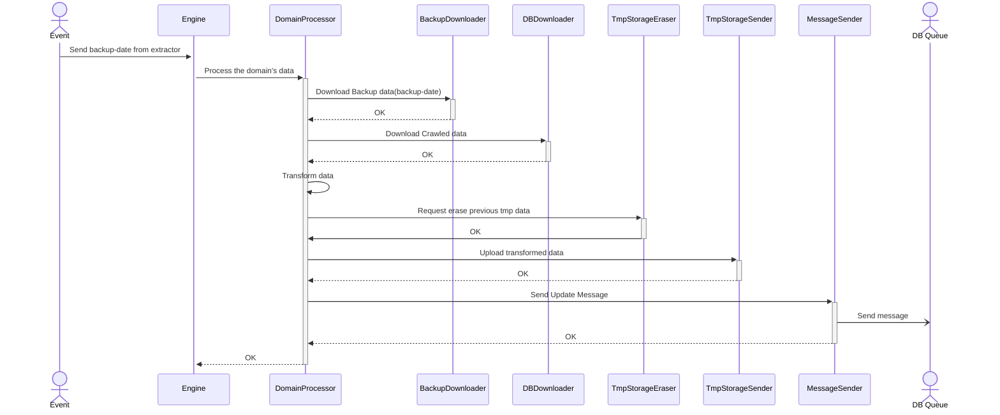

# Pyoniverse Transform Crawling
## Architecture

```mermaid
sequenceDiagram
    actor Event
    participant Engine
    participant DomainProcessor
    participant BackupDownloader
    participant DBDownloader
    participant TmpStorageEraser
    participant TmpStorageSender
    participant MessageSender
    actor DB Queue

    Event ->>+ Engine: Send backup-date from extractor
    Engine ->>+ DomainProcessor: Process the domain's data
    DomainProcessor ->>+ BackupDownloader: Download Backup data(backup-date)
    BackupDownloader -->>- DomainProcessor: OK
    DomainProcessor ->>+ DBDownloader: Download Crawled data
    DBDownloader -->>- DomainProcessor: OK
    DomainProcessor ->> DomainProcessor: Transform data
    DomainProcessor ->>+ TmpStorageEraser: Request erase previous tmp data
    TmpStorageEraser ->>- DomainProcessor: OK
    DomainProcessor ->>+ TmpStorageSender: Upload transformed data
    TmpStorageSender -->>- DomainProcessor: OK
    DomainProcessor ->>+ MessageSender: Send Update Message
    MessageSender -) DB Queue: Send message
    MessageSender -->>- DomainProcessor: OK
    DomainProcessor -->>- Engine: OK
```
- Domain별 처리(Product, Event)
- Backup 이후 실행되는 파이프라인이기 때문에 Service Data는 Backup Data에서 가져온다.
